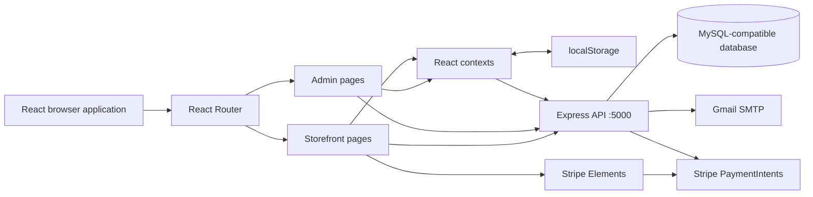

# Architecture

> Current men?s taxonomy and mega-navigation: [Men?s catalog](MENS_CATALOG.md) supersedes older static/six-department category notes below.

> Hero/banner implementation updated: [Hero and campaign management](HERO_CAMPAIGNS.md) supersedes the older banner storage, field mapping, API and carousel notes below.

> Catalog changes: see [Catalog navigation update](CATALOG_NAVIGATION.md). This supersedes the older catalog mapping, subcategory persistence, silent-save and navigation-filter observations below.

## Runtime structure

Sources: [entry point](../my-app/src/main.tsx), [app routes](../my-app/src/App.tsx), [server](../server/server.js), [database configuration](../server/config/db.js).

The frontend is a React 19 application using mixed JSX/TSX, React Router 7, Vite 8, Tailwind CSS 4, and React Icons. These are manifest major versions, not claims about the latest public releases. The backend uses ES modules, Express 4, mysql2 promise pools, bcryptjs, jsonwebtoken, Nodemailer, and Stripe. There is no ORM, controller/service layer, queue, websocket server, or migration framework in the supplied source. Route handlers perform SQL and business logic directly.

## Frontend composition

`StrictMode -> BrowserRouter -> AuthProvider -> ProductProvider -> CartProvider -> WishlistProvider -> App`.

`App` supplies pathname-based scroll reset and two layouts. Public pages share `Navbar`, `main/Outlet`, and `Footer`. The homepage composes `Hero`, `Categories`, `FeaturedProducts`, and `LogoCarousel`. `AdminLayout` validates the restored token through `/api/auth/me`, requires the server user to be an admin, redirects invalid sessions to login, and wraps an allowed outlet with `AdminAlertProvider`, desktop/mobile navigation, and a header.

## Feature and persistence map

| Feature | Current data owner | Actual integration status |
| --- | --- | --- |
| Login/register | API plus `AuthContext` | Real JWT path; network-like errors also create demo sessions |
| Profile edits | `AuthContext` / localStorage | No profile-update API |
| Products | SQL plus `ProductContext` cache/fallback | Load/create integrated; update/delete can silently diverge |
| Categories | SQL plus `ProductContext` cache/fallback | CRUD requests exist, but failures can be presented as local success |
| Hero and two-column banners | `ProductContext` / localStorage | Admin and homepage do not consume the existing banner API |
| Collections | SQL / admin component state | CRUD integrated; no collection-product membership or storefront consumer |
| Cart and wishlist | localStorage | No server synchronization or per-user partition |
| Checkout | API orders; local receipt copy | COD path implemented; card flow incomplete |
| Account order count | `AuthContext.orders` | Includes local/demo records |
| Order history/tracking | Authenticated orders API | Does not use local receipt history |
| Dashboard | Orders API plus product context | Mix of computed values and static sample metrics |
| Customers and customer ledger | Admin API / SQL | List, edit, delete, detail, and manual credits implemented |
| Suppliers | Admin API / SQL | CRUD with live purchase, paid, due, invoice-count and last-purchase aggregates |
| Purchase invoices / stock-in | Admin API / SQL | Create/edit/delete stock transactions, payment updates, filters, export and invoice printing |
| Transactions | Component constants | Demo list and totals |
| System settings / coupons | Component state | Save feedback only; resets after unmount/reload |
| Reviews and contact form | Component state | No persistence or submission API |

## Browser storage contract

| Key | Owner | Stored content |
| --- | --- | --- |
| `shophub_user` | AuthContext | User object, token, local profile extras |
| `shophub_orders` | AuthContext | Local receipts; starts with a sample order if absent |
| `shophub_products` | ProductContext | Frontend-shaped product objects |
| `shophub_categories` | ProductContext | Category objects with `img` |
| `shophub_banners` | ProductContext | Slider records and array ordering |
| `shophub_twocolumn_banners` | ProductContext | Two promotional cards |
| `shophub_cart` | CartContext | Product snapshots, variant choices, quantity |
| `shophub_wishlist` | WishlistContext | Product snapshots |
| `dynamic_brands` | LogoCarousel | Optional externally populated brand array; no editor found |

Storage is shared by users of the same browser origin. Logout clears only the user. Product/category writes retry without embedded image data after quota exhaustion. Empty saved product/banner arrays can restore defaults on initialization. Successful API product/category responses replace fallback data, including with an empty array. No storage-event synchronization or explicit cache invalidation scheme exists.

## Server lifecycle

`server.js` enables unrestricted CORS and 50 MB JSON/urlencoded parsing, mounts seven routers, and installs a generic 500 handler. It begins listening before database initialization and SMTP verification finish. The root response proves only that HTTP is responding; it is not a dependency-readiness check. Initialization errors are logged and swallowed. `orderRoutes.js` constructs Stripe at import time, making Stripe configuration relevant even to COD startup.

The main SQL pool allows 10 connections. Orders and purchases use dedicated connections for transactions. Most other endpoints use individual pool queries. Order-list endpoints execute one extra item query per order; purchases load invoice rows and item rows in two queries.
