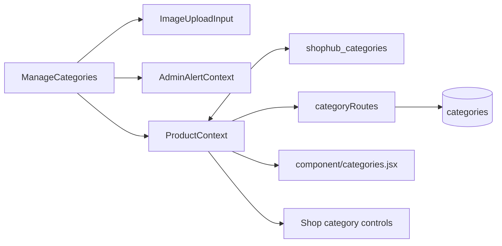

# Working on ManageCategories

> Current men?s taxonomy and mega-navigation: [Men?s catalog](MENS_CATALOG.md) supersedes older static/six-department category notes below.

> Catalog changes: see [Catalog navigation update](CATALOG_NAVIGATION.md). This supersedes the older catalog mapping, subcategory persistence, silent-save and navigation-filter observations below.

Main screen: [ManageCategories.jsx](../my-app/src/pages/admin/ManageCategories.jsx), mounted at `/admin/categories`.

## Files involved

Data fields are `id`, `name`, display-string `count`, `img`, navigation `link`, `isVisible`, and SQL `created_at`. The count is manually entered text, not a product count query. The current admin manages homepage category cards; it does not implement a database-backed category hierarchy.

## Screen behavior

- Search matches lowercase category names.
- Summary cards count all categories, visible categories (`isVisible !== false`), and hidden ones.
- Add/edit uses `formData`, `editingId`, `showForm`, and `isLoading`.
- Name changes generate `/shop?category=` with `encodeURIComponent`, but only while `link` is empty. A link can therefore retain a partial earlier name.
- Save requires a truthy name and image. It uses a fallback generated link if empty and sets new categories visible.
- Visibility toggle sends only `isVisible` through `updateCategory`.
- Delete uses an inline confirmation ID, then the context delete helper.
- Image rendering tracks broken image IDs and uses a fallback image; image input supports URL or compressed data URL.

## API behavior

[categoryRoutes.js](../server/routes/categoryRoutes.js) exposes a public list and admin-protected create/update/delete. List includes hidden categories. Update accepts only defined members of `name`, `count`, `img`, `link`, `isVisible`; it allows a visibility-only payload. This differs from the full-field product/banner/collection updates.

The helper's current success semantics are misleading: category creation appends locally even on a rejected response, and update/delete ignore unsuccessful responses. The UI's catch blocks therefore cannot reliably detect persistence failures. Confirm success with a subsequent API read or database inspection when debugging.

## Display and relationship details

[Homepage categories](../my-app/src/component/categories.jsx) hide entries with boolean false and fall back to sample cards when the category array is empty. [ProductContext](../my-app/src/context/ProductContext.jsx) converts API visibility to Boolean, but other local paths may contain different types. Maintain a consistent boolean contract.

Shop filters compare lowercase trimmed category/subcategory text exactly. It does not convert hyphens to spaces or map aliases such as `Jeans` to `Denim Jeans`. The SQL seed links, browser sample links, navbar hierarchy, and product normalizer use different names. A visible card can navigate to an empty result even when a related product exists.

Deleting a SQL category sets linked `products.category_id` to null; it leaves `category_name` text unchanged. Current product UI requests send category text and omit category_id, so many products may not have a relational category link at all. Renaming a category does not rename product category text. Seeded IDs can be reinserted at server restart by schema initialization.

## Useful manual checks

1. Use a disposable database and a real admin JWT; create a uniquely named category with a matching product category and a URL image.
2. Refresh and confirm it survives an API reload; verify its returned database ID.
3. Update only visibility, then reload the homepage and verify the card is hidden without losing its fields.
4. Rename the category and inspect the generated link and matching shop results.
5. Simulate a rejected save and verify whether the screen reports success; this currently exposes the silent-save issue.
6. Compare a compressed upload before/after reload and watch for SQL length/browser quota failures.
7. Delete a non-seeded category and inspect linked product category references. Avoid seed IDs when checking persistent deletion behavior.

When changing fields, update the SQL/schema guide, route allowlist, context mapping, editor, public card, Shop filters, and route documentation together.
