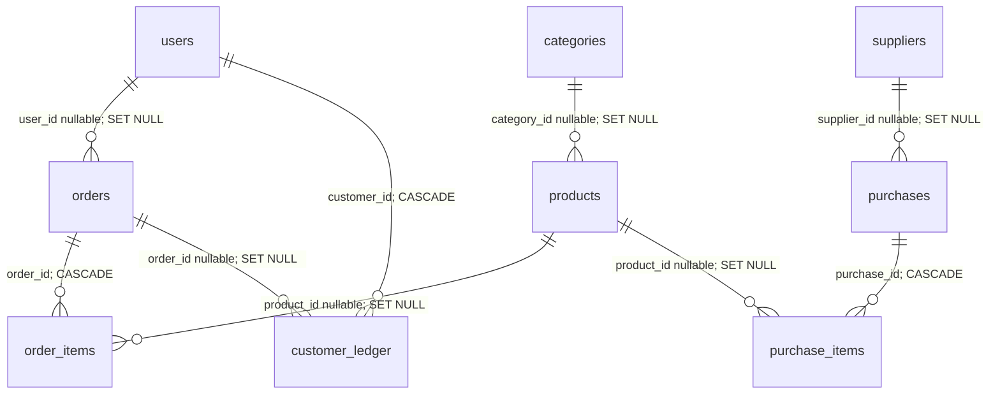

# Database schema and schema changes

> Current men?s taxonomy and mega-navigation: [Men?s catalog](MENS_CATALOG.md) supersedes older static/six-department category notes below.

> Hero/banner implementation updated: [Hero and campaign management](HERO_CAMPAIGNS.md) supersedes the older banner storage, field mapping, API and carousel notes below.

> Catalog changes: see [Catalog navigation update](CATALOG_NAVIGATION.md). This supersedes the older catalog mapping, subcategory persistence, silent-save and navigation-filter observations below.

Source baseline: 2026-09-09. Authoritative definitions are [server/schema.sql](../server/schema.sql) plus startup DDL in [server/config/db.js](../server/config/db.js). This describes intended source structure, not an introspected live database. There are 11 tables and no ORM models or versioned migration directory.

## Relationships



Labels identify nullable references where the compact diagram does not express optional parent cardinality. Banners and collections are standalone; there is no collection-product join table.

## Table ownership

| Table | Meaning | Main writer |
| --- | --- | --- |
| users | Auth identities and roles | authRoutes; admin customer edits |
| categories | Homepage category cards and optional product FK target | categoryRoutes |
| banners | SQL banner records, disconnected from current frontend banner storage | bannerRoutes |
| collections | Collection metadata and manual display count | collectionRoutes |
| products | Catalog price, inventory, category text and optional FK | productRoutes; orders; purchases |
| orders | Shipping/customer snapshot and order/payment state | orderRoutes |
| order_items | Product/name/price/image snapshots per order | orderRoutes |
| suppliers | Supplier contact information | adminRoutes |
| purchases | Supplier invoice totals, payment state and date | adminRoutes |
| purchase_items | Purchased product quantities and unit cost | adminRoutes |
| customer_ledger | Manual debit/credit storage; API currently inserts credits | adminRoutes |

## Exact table definitions

The following copies the CREATE TABLE statements from schema.sql so every column, type, default, nullability, uniqueness constraint, and foreign-key delete behavior is visible. Except primary-key columns, fields without explicit NOT NULL can be nullable even when a default is present. DECIMAL values may arrive as strings from mysql2; the UI often converts them with Number. BOOLEAN values are converted by some frontend paths. No explicit engine, charset, collation, or CHECK constraints are set here.

### users

```sql
CREATE TABLE IF NOT EXISTS users (
  id INT AUTO_INCREMENT PRIMARY KEY,
  name VARCHAR(255) NOT NULL,
  email VARCHAR(255) NOT NULL UNIQUE,
  password VARCHAR(255) NOT NULL,
  role ENUM('user', 'admin') DEFAULT 'user',
  created_at TIMESTAMP DEFAULT CURRENT_TIMESTAMP
);
```

### categories

```sql
CREATE TABLE IF NOT EXISTS categories (
  id INT AUTO_INCREMENT PRIMARY KEY,
  name VARCHAR(255) NOT NULL,
  count VARCHAR(100) DEFAULT '0 Products',
  img TEXT NOT NULL,
  link VARCHAR(255) DEFAULT '/shop',
  isVisible BOOLEAN DEFAULT TRUE,
  created_at TIMESTAMP DEFAULT CURRENT_TIMESTAMP
);
```

### banners

```sql
CREATE TABLE IF NOT EXISTS banners (
  id INT AUTO_INCREMENT PRIMARY KEY,
  title VARCHAR(255) NOT NULL,
  description TEXT,
  buttonText VARCHAR(100) DEFAULT 'Shop Now',
  image TEXT NOT NULL,
  isActive BOOLEAN DEFAULT TRUE,
  position INT DEFAULT 0,
  created_at TIMESTAMP DEFAULT CURRENT_TIMESTAMP
);
```

### collections

```sql
CREATE TABLE IF NOT EXISTS collections (
  id INT AUTO_INCREMENT PRIMARY KEY,
  name VARCHAR(255) NOT NULL,
  description TEXT,
  badge VARCHAR(50) DEFAULT 'SALE',
  image TEXT,
  productCount INT DEFAULT 0,
  isActive BOOLEAN DEFAULT TRUE,
  created_at TIMESTAMP DEFAULT CURRENT_TIMESTAMP
);
```

### products

```sql
CREATE TABLE IF NOT EXISTS products (
  id INT AUTO_INCREMENT PRIMARY KEY,
  name VARCHAR(255) NOT NULL,
  sku VARCHAR(100) UNIQUE,
  category_id INT,
  category_name VARCHAR(255),
  price DECIMAL(10, 2) NOT NULL,
  original_price DECIMAL(10, 2),
  stock INT DEFAULT 0,
  image TEXT,
  description TEXT,
  status ENUM('Active', 'Low Stock', 'Out of Stock') DEFAULT 'Active',
  rating DECIMAL(2, 1) DEFAULT 4.5,
  reviews_count INT DEFAULT 0,
  created_at TIMESTAMP DEFAULT CURRENT_TIMESTAMP,
  FOREIGN KEY (category_id) REFERENCES categories(id) ON DELETE SET NULL
);
```

### orders

```sql
CREATE TABLE IF NOT EXISTS orders (
  id VARCHAR(50) PRIMARY KEY,
  user_id INT NULL,
  customer_name VARCHAR(255) NOT NULL,
  email VARCHAR(255) NOT NULL,
  phone VARCHAR(50),
  address TEXT NOT NULL,
  city VARCHAR(100),
  total_amount DECIMAL(10, 2) NOT NULL,
  payment_method VARCHAR(50) DEFAULT 'Cash on Delivery',
  payment_status VARCHAR(50) DEFAULT 'Unpaid',
  transaction_id VARCHAR(255),
  order_status ENUM('Pending', 'Processing', 'Shipped', 'Delivered', 'Completed', 'Cancelled') DEFAULT 'Pending',
  created_at TIMESTAMP DEFAULT CURRENT_TIMESTAMP,
  FOREIGN KEY (user_id) REFERENCES users(id) ON DELETE SET NULL
);
```

### order_items

```sql
CREATE TABLE IF NOT EXISTS order_items (
  id INT AUTO_INCREMENT PRIMARY KEY,
  order_id VARCHAR(50) NOT NULL,
  product_id INT NULL,
  product_name VARCHAR(255) NOT NULL,
  price DECIMAL(10, 2) NOT NULL,
  quantity INT NOT NULL,
  image TEXT,
  FOREIGN KEY (order_id) REFERENCES orders(id) ON DELETE CASCADE,
  FOREIGN KEY (product_id) REFERENCES products(id) ON DELETE SET NULL
);
```

### suppliers

```sql
CREATE TABLE IF NOT EXISTS suppliers (
  id INT AUTO_INCREMENT PRIMARY KEY,
  name VARCHAR(255) NOT NULL,
  company_name VARCHAR(255),
  phone VARCHAR(50),
  email VARCHAR(255),
  address TEXT,
  created_at TIMESTAMP DEFAULT CURRENT_TIMESTAMP
);
```

### purchases

```sql
CREATE TABLE IF NOT EXISTS purchases (
  id INT AUTO_INCREMENT PRIMARY KEY,
  supplier_id INT NULL,
  invoice_no VARCHAR(100) NOT NULL UNIQUE,
  total_amount DECIMAL(12, 2) NOT NULL DEFAULT 0.00,
  paid_amount DECIMAL(12, 2) NOT NULL DEFAULT 0.00,
  due_amount DECIMAL(12, 2) NOT NULL DEFAULT 0.00,
  payment_status ENUM('Paid', 'Unpaid', 'Partial') DEFAULT 'Unpaid',
  payment_method ENUM('Cash', 'Bank Transfer') DEFAULT 'Cash',
  purchase_date DATE NOT NULL,
  created_at TIMESTAMP DEFAULT CURRENT_TIMESTAMP,
  FOREIGN KEY (supplier_id) REFERENCES suppliers(id) ON DELETE SET NULL
);
```

### purchase_items

```sql
CREATE TABLE IF NOT EXISTS purchase_items (
  id INT AUTO_INCREMENT PRIMARY KEY,
  purchase_id INT NOT NULL,
  product_id INT NULL,
  quantity INT NOT NULL DEFAULT 1,
  cost_price DECIMAL(12, 2) NOT NULL DEFAULT 0.00,
  FOREIGN KEY (purchase_id) REFERENCES purchases(id) ON DELETE CASCADE,
  FOREIGN KEY (product_id) REFERENCES products(id) ON DELETE SET NULL
);
```

### customer_ledger

```sql
CREATE TABLE IF NOT EXISTS customer_ledger (
  id INT AUTO_INCREMENT PRIMARY KEY,
  customer_id INT NOT NULL,
  entry_type ENUM('debit', 'credit') NOT NULL,
  amount DECIMAL(10, 2) NOT NULL,
  description VARCHAR(255) NOT NULL,
  order_id VARCHAR(50),
  payment_method VARCHAR(100),
  created_at TIMESTAMP DEFAULT CURRENT_TIMESTAMP,
  FOREIGN KEY (customer_id) REFERENCES users(id) ON DELETE CASCADE,
  FOREIGN KEY (order_id) REFERENCES orders(id) ON DELETE SET NULL
);
```

## Startup changes outside schema.sql

After executing the schema, db.js attempts these operations in order:

```sql
ALTER TABLE orders MODIFY COLUMN order_status
  ENUM('Pending', 'Processing', 'Shipped', 'Delivered', 'Completed', 'Cancelled') DEFAULT 'Pending';
ALTER TABLE orders
  ADD COLUMN IF NOT EXISTS payment_status VARCHAR(50) DEFAULT 'Unpaid',
  ADD COLUMN IF NOT EXISTS transaction_id VARCHAR(255);
ALTER TABLE products ADD COLUMN IF NOT EXISTS stock_quantity INT DEFAULT 0;
UPDATE products SET stock_quantity = stock
  WHERE (stock_quantity IS NULL OR stock_quantity = 0) AND stock > 0;
```

`stock_quantity` is therefore an additional runtime column, not part of the products CREATE TABLE above. Applying only schema.sql is insufficient for purchase insertion code. Startup DDL compatibility must be verified on the actual engine/version: the project names MySQL/XAMPP but does not pin a database version. An initialization exception is logged and swallowed, so later DDL may never execute.

The schema begins with `CREATE DATABASE IF NOT EXISTS ecommerce_db; USE ecommerce_db;`. Changing DB_NAME alone can create/connect a different database while the schema still operates on ecommerce_db. Resolve this before using another database name.

## Seeds and missing models

Every startup replays INSERT IGNORE for five fixed-ID categories and three fixed-ID banners. There are no SQL product, user, supplier, collection, or order seeds. Browser sample data independently contains ten products (IDs 101-110), nine categories, ten brand logos, plus context banner and order defaults. These datasets are not imported into SQL. Existing primary-key seed rows are kept; deleting one allows it to be reinserted at the next startup.

No SQL tables exist for carts, wishlists, product variants, reviews, coupons, settings, contacts, media assets, payment-provider events, or brands. User phone/address/city fields exist only in browser profile state; orders store their own shipping snapshot. Orders have no separate discount/shipping/currency columns. Product category_name is denormalized and can disagree with category_id. Category count and collection productCount are manually maintained display values.

## Indexes and deletion implications

Explicit unique constraints cover users.email, products.sku, and purchases.invoice_no in addition to primary keys. Foreign keys may require/create supporting indexes in the selected database engine; no additional search/reporting indexes are declared. Deleting a user retains orders but removes manual ledger rows. Deleting an order cascades its item rows and nulls linked ledger order references. Deleting a product retains order and purchase items with null product_id; order item names/prices survive, but purchase item product names are joined from the current product table. Supplier deletion retains invoices with null supplier_id.

## Schema change log: observed source, not historical dates

| Layer | Present behavior | History status |
| --- | --- | --- |
| schema.sql | Eleven base tables and fixed category/banner seeds | Original introduction date unknown |
| db.js | Expands order status enum, adds payment fields if absent | Undated compatibility code; no migration version |
| db.js | Adds and backfills stock_quantity | Undated compatibility code; inventory writers now differ |
| Documentation, 2026-09-09 | Records the above structure | No schema or data changes executed in this pass |

## Procedure for future schema changes

1. Inspect SHOW CREATE TABLE for the actual target database and identify drift from both source layers. Back up and test restoration using a separate database before changing persistent data.
2. Add an ordered migration with engine-compatible DDL and an explicit rollback/recovery plan. Keep fresh-install schema consistent with the migrated target.
3. Test fresh initialization and upgrade from an existing snapshot; verify defaults, nullable relationships, indexes, and seeded-data behavior.
4. Update every API writer/reader and frontend mapping affected by a field change. For inventory, reconcile stock and stock_quantity before choosing a single field.
5. Record the completed migration, expected data conversion, verification results, and operational notes in the changelog and this guide.

These are proposed maintenance steps; a migration runner and backup automation are not currently implemented.
