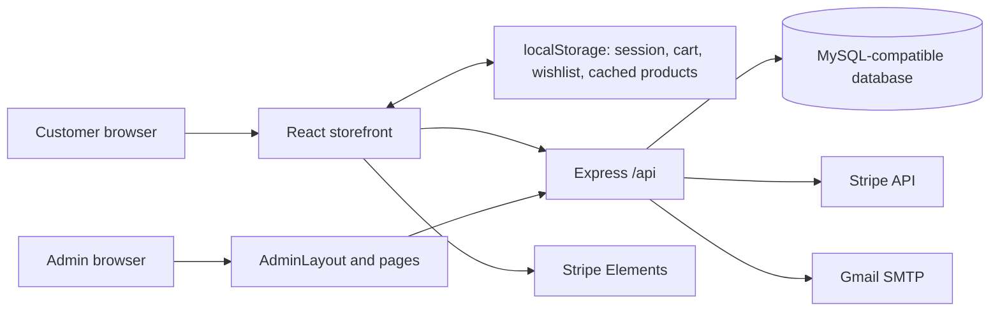

# ShopHub project report — 13 September 2026

Yeh report current local source, configuration, existing tests aur production build ki bunyaad par hai. ShopHub men's fashion aur lifestyle ka full-stack e-commerce project hai. Storefront ke saath kaafi bara administration aur stock-management system bana hua hai. Development ke liye achhi functional foundation hai, lekin current authentication flaws, incomplete payment recovery aur data inconsistencies ki wajah se real customers ke liye abhi production-ready qarar nahin diya ja sakta.

Review mein application routes, contexts, business logic, SQL schemas, shared utilities, admin/storefront integrations aur test/configuration files inspect kiye gaye. Assets inventory kiye gaye; har image ki visual quality ya har browser interaction verify nahin ki gayi. Dependencies ke generated source, lockfiles ki har entry aur private environment values ka manual audit is report ka hissa nahin. Live DB integration tests, real card payments aur email delivery execute nahin ki gayi. Application code fix nahin kiya gaya; report aur source inventory add ki gayi hai. Build ne generated dist output refresh kiya.

File paths, line counts aur API declaration index: [Source inventory](PROJECT_SOURCE_INVENTORY_2026-09-13.md).

## 1. Technology aur folder structure

| Hissa | Technology / zimmedari |
| --- | --- |
| `my-app/` | React 19, React Router 7, Vite 8, Tailwind CSS 4; JSX aur TSX dono |
| `server/` | Node.js ES modules, Express 4, mysql2 promise pool, raw SQL |
| `shared/` | Men's category taxonomy, aliases, variant generation aur validation |
| `scripts/` | Combined development launcher aur Chrome-based UI checks |
| `docs/` | Architecture, database, features, APIs aur development documentation |
| `artifacts/` | Pehle se maujood hero, navigation aur inventory screenshots |
| `my-app/public/images/` | Campaign images aur generation prompt text |
| `my-app/src/assets/` | Logo aur imported photographs |

Manifest mein bcryptjs, jsonwebtoken, Nodemailer aur Stripe backend integrations hain. Frontend Stripe Elements aur React Icons use karta hai. Axios declared hai lekin inspected application callers `fetch` use karte hain. Frontend mein server-side Stripe package bhi declared hai; actual card UI browser Stripe packages use karta hai.

Separate frontend/backend package files aur dependency installs hain. Root package.json/workspaces setup nahin mila. Backend package mein sirf `start` aur `dev` scripts hain; test files maujood hone ke bawajood `npm test` script nahin.

## 2. Application ka flow



Frontend entry chain: `StrictMode → BrowserRouter → AuthProvider → ProductProvider → CartProvider → WishlistProvider → App`.

Public layout Navbar, page content aur Footer dikhata hai. Admin layout backend `/api/auth/me` se token aur admin role verify karta hai. Backend bhi protected endpoints par user ko database se load karke role check karta hai. Sirf browser mein role badalne se protected API access nahin milta; neeche listed signup/login flaws alag backend problems hain.

Route handlers mein SQL aur business logic ek saath hain. Kuch reusable domain utilities maujood hain, magar formal controller/service/repository structure nahin. Database setup base SQL, operations SQL aur runtime schema helpers mein divided hai. Catalog ke liye `app_migrations` marker hai, lekin poore database ka unified versioned migration workflow nahin.

## 3. Customer-facing pages

| Route / screen | Kya karta hai | Haalat |
| --- | --- | --- |
| `/` | Hero campaigns, promo cards, categories, featured products, brand strip | API aur frontend content dono |
| `/shop`, `/products` | Product list, search, category/subcategory/type, fit, occasion, size, color, price aur sorting | Implemented; kuch filter options hardcoded |
| `/product/:id` | Images, prices, variant selection, stock, related products, approved reviews | API-loaded product context aur review API |
| `/cart` | Variant-aware items, quantities, remove, totals | localStorage; currency/shipping mismatch |
| `/wishlist` | Saved products aur shopping actions | Browser-only persistence |
| `/checkout` | Shipping details, server quote, coupon, COD/card | Backend implemented; recovery/validation gaps |
| `/order-success` | Recent order receipt | Router state; payment wording inaccurate for COD |
| `/login` | Register/login aur role-based redirect | Real API; backend auth defects remain |
| `/account` | Profile aur local account/order summary | Profile changes sirf localStorage |
| `/orders` | Own server orders, tracking, cancellation, return requests | Auth required; errors can look like empty history |
| `/about` | Store information | Static content |
| `/contact` | Contact information aur message form | Form success local state only; no submission API |
| `/faq`, `/policies` | Shipping, returns aur related information | Static; business rules inconsistent |
| Unknown route | Not-found screen | Implemented |

Navbar desktop mega-menu aur mobile dialog use karta hai. Categories database catalog tree se aati hain. Four fixed departments: **Top Wear, Bottom Wear, Eastern Wear, Accessories**. Har department ke subcategories aur teesri level par product types hain. `shared/mensCatalog.js` purane names/slugs ke aliases bhi handle karta hai.

Hero/promo banners ab database se aate hain. Admin title, description, CTA links, image, crop, badge, visibility aur order edit kar sakta hai. Empty banner list default campaigns dobara nahin banati. Carousel reduced-motion preference aur hidden browser tab ka lihaz karta hai. Current carousel mein explicit pause button nahin hai.

## 4. Admin modules

| Module | Implemented functionality | Limitation / note |
| --- | --- | --- |
| Dashboard | Orders, revenue calculation, recent orders/status | Sample metrics, static top products/counts aur inconsistent revenue definition |
| Products | Add/edit, search, filters, images, categories, attributes, variants, soft delete | Normalization aur legacy stock consistency issues |
| Attributes | Text/color definitions, values, validation | Used attributes protected by relational constraints; changed definitions can need product reconciliation |
| Banners | Hero/promo CRUD, active state, preview, ordering | Real API-backed module |
| Categories | Homepage card CRUD aur nested ManageNavigation editor | Homepage cards aur catalog tree separate models |
| Navigation | Department metadata, child categories/product types | Embedded inside Categories; separate route nahin |
| Collections | Metadata CRUD, active state, image, display count | Products ki membership aur storefront consumer nahin mila; edit payload issue |
| Orders | List, search, status update, customer details | Email feedback bug; incomplete status-transition rules |
| Customers | List/edit/delete, order details, ledger, manual credits, invoice print | Profile/admin data contracts separate; print escaping issue |
| Suppliers | CRUD, purchases/paid/due totals, dates, export | Real SQL integration |
| Purchases | Invoice create/edit/delete, items, variants, stock-in, paid/due, payment update, print/export | Payment update concurrency issue; historical cost model limited |
| Inventory | Stock, purchase/sales summaries, low-stock threshold, warehouse, adjustment history, export | One warehouse assignment per product; variant adjustments via product editor |
| Reviews | Pending/approved/rejected moderation, edit/delete | Purchase verification requirement implemented nahin |
| Returns | Whole-order request/approve/reject/receive/refund record | Actual money transfer nahin; one return/refund record per order |
| Coupons & Discounts | Fixed/percentage, schedules, minimum spend, product targeting | Single best offer; no stacking or usage quota model |
| Transactions | Transaction table/filter UI | Hardcoded sample data |
| Reports | Order/product aggregates aur CSV export | API failure par local fallback; fallback fields mismatch |
| Settings | Store/contact/social/shipping/payment/notification UI | Save only toggles local component feedback; reload par reset |

Settings ke demo coupons aur `/admin/coupons` ke real promotions alag hain. EasyPaisa, JazzCash, bank transfer aur 1LINK ke UI labels se actual payment integration prove nahin hoti.

## 5. Database structure

Source schema definitions mein **25 distinct tables** hain; yeh live database table count ki claim nahin.

| Group | Tables | Purpose |
| --- | --- | --- |
| Accounts | `users`, `customer_ledger` | Identity/roles aur manual customer credits |
| Catalog/content | `categories`, `catalog_nodes`, `collections`, `banners` | Homepage cards, taxonomy, collection metadata, campaigns |
| Products/variants | `products`, `product_attributes`, `attribute_values`, `product_attribute_values`, `product_variants`, `variant_attribute_values` | Product commercial data aur attribute combinations |
| Sales | `orders`, `order_items`, `order_payment_receipts` | Customer/shipping snapshots, items, unique card receipt |
| Procurement | `suppliers`, `purchases`, `purchase_items` | Supplier invoices, quantities, costs aur payments |
| Inventory | `warehouses`, `inventory_settings`, `stock_adjustments` | Location, thresholds aur movement history |
| Operations | `product_reviews`, `return_requests`, `promotions` | Moderation, returns/refunds aur discounts |
| Migration marker | `app_migrations` | Catalog seed/migration completion |

Relations: user → orders → order_items; product → variants; supplier → purchases → purchase_items; orders → return_requests/payment receipts. Soft-deleted products historical rows retain karte hain. Catalog IDs aur legacy category text dono store hote hain. Cart, wishlist, settings, contact messages aur customer address-book ki dedicated tables nahin milin.

Orders mein grand total store hota hai, lekin separate shipping, discount, applied coupon aur currency snapshot columns nahin. Is wajah se baad mein exact financial breakdown reconstruct karna mushkil ho sakta hai.

Images: products aur variants LONGTEXT; banners MEDIUMTEXT; `order_items.image`, category image aur collection image abhi TEXT hain. Yeh size inconsistency checkout ko affect kar sakti hai.

## 6. Important business flows

**Product/variant:** Admin attributes choose karta hai, combinations generate karta hai, har row ka SKU/image/price/sale price/stock save hota hai. Maximum 200 combinations. Removed combinations inactive hote hain. Product summary cheapest active variant aur active variants ke total stock se banti hai. Existing variant stock ke liye original-stock comparison stale edits reject kar sakta hai.

**Checkout:** Browser cart → `/operations/quote` → database prices, availability, discount aur shipping → order submission → server dobara quote/stock check → order/items aur stock changes ek transaction mein → commit → email attempt. Authenticated order ownership token se aati hai; caller-supplied userId trust nahin hota. Guest user_id null rehta hai.

**Card:** Server quoted PKR amount se PaymentIntent banata hai; browser confirms; order endpoint Stripe se succeeded status, amount, currency aur customer email verify karta hai. Unique payment receipt reuse rokta hai. Lekin payment aur order ek recoverable checkout lifecycle mein linked nahin: confirmation ke baad DB/stock/network failure ka automated reconciliation absent hai.

**Shipping:** Current authoritative quote `subtotal > 2000` par free, warna Rs. 200 hai. Exactly Rs. 2,000 par fee lagti hai. Shipping eligibility pre-discount subtotal par calculate hoti hai. Cart aur policy/settings ka rule is se alag hai.

**Purchases:** Invoice save stock increase karta hai. Edit quantity delta apply karta hai. Delete original units reverse karta hai; consumed stock ki wajah se negative result ho to reject. Variants bhi supported hain, contrary to older VARIANTS.md wording.

**Cancellation/returns:** Pending/Processing cancellation stock restore karti hai. Paid cancellation refund queue banati hai. Return transitions Requested → Approved → Received → Refunded; allowed rejection branches bhi hain. Received par stock once restore hota hai. Refund form external completed transfer ka reference record karta hai, bank/Stripe ko paisa bhejne ka request nahin.

**Reviews:** Signed-in customer one review per product submit karta hai. Admin approval public visibility aur aggregate rating update karta hai.

## 7. Source-confirmed issues aur priorities

| Priority | Finding aur impact | Evidence |
| --- | --- | --- |
| Critical | Public registration body se `role=admin` accept hota hai; ordinary caller privileged account bana sakta hai | `server/routes/authRoutes.js`, register |
| Critical | Existing admin login mein fixed-password bypass stored hash check ko skip karta hai | `server/routes/authRoutes.js`, isMasterAdminPass |
| High | Missing JWT_SECRET par predictable source-embedded signing secret use hota hai | authRoutes + authMiddleware |
| High | Card succeeds, order save fails: no webhook/reconciliation or persisted recovery state; retry fresh payment bana sakta hai | Checkout, StripeCheckoutForm, orderRoutes |
| High | Uploaded product/variant image order_items ke TEXT field se bari ho sakti hai; strict DB mode mein insert fail, doosre modes mein truncation possible | schema.sql + orderRoutes image insert + ImageUploadInput |
| High | Invoice HTML mein `items_summary` escaping ke baghair document.write; stored markup script execution risk | CustomerDetails.tsx, printInvoice |
| High | Product normalization contract broken: existing tests mein size/color clearing aur inStock missing | src/utils/catalog.js; 3 reproduced failures |
| High | Simple-product create/update strong numeric stock/price validation enforce nahin karta; stock_quantity bhi direct write mein sync nahin | productRoutes POST/PUT |
| Medium | Cart `$` totals aur >50/free otherwise 10 rule use karta hai; checkout Rs./>2000 otherwise 200; FAQ/settings further disagree | Cart.jsx, operations.js, Faq.jsx, SystemSettings.tsx |
| Medium | Card Pay button type=button hai; required shipping form browser validation trigger nahin hoti. Backend email nonempty check ke ilawa address/phone/city required validation nahin karta | StripeCheckoutForm + orderRoutes |
| Medium | `emailSent` undefined rehta hai even after SMTP acceptance, kyun ke sendOrderStatusEmail return nahin karta | sendEmail.js, orderRoutes, manageorders.jsx |
| Medium | Initial order quote lines `name` use karti hain; email formatter product_name/title padhta hai, is liye initial email mein generic Product aa sakta hai | operations.js + sendEmail.js |
| Medium | SMTP certificate verification explicitly disabled | sendEmail.js tls config |
| Medium | CORS unrestricted, 50 MB body limit, raw internal errors aur no application rate limiting | server.js + route handlers |
| Medium | DB_NAME configurable hai lekin schema.sql `USE ecommerce_db` hardcoded karta hai | config/db.js + schema.sql |
| Medium | Server HTTP-ready ho jata hai before schema initialization; initialization failures swallowed; global /api middleware bhi DDL karta hai | server.js, db.js, variantSchema.js |
| Medium | DB engine/version pinned nahin; ADD COLUMN IF NOT EXISTS compatibility target environment par verify karni hogi | db.js |
| Medium | Kuch order/purchase handlers pool.getConnection try block se bahar await karte hain; acquisition rejection local error handling se bahar hai | orderRoutes/adminRoutes |
| Medium | Purchase payment patch total read aur update ko lock/transaction mein nahin rakhta; concurrent invoice edit stale due/payment values bana sakta hai | adminRoutes PATCH purchase payment |
| Medium | Stock-status thresholds disagree: purchases <10, operations <=5, inventory user-configured; variant summary alag rule | adminRoutes, operations.js, variants.js, inventory_settings |
| Medium | Variant editor direct stock overwrite ka movement log nahin; full stock audit incomplete | saveVariants vs changeStock |
| Medium | Historical simple product ko variants mein convert karne par old order items ka variant ID null; cancellation/return restoration fail ho sakti hai | changeStock requires variant; old snapshots unchanged |
| Medium | Delivered/Completed status COD ko Paid nahin karta; manual customer credit specific order settle nahin karta | status update + customer payments endpoint |
| Medium | Collections edit `isActive` omit karta hai, backend unconditional update karta hai | ManageCollections + collectionRoutes |
| Medium | Local user/order/cart/wishlist storage account-partitioned nahin; logout sirf user clear karta hai | AuthContext, CartContext, WishlistContext |
| Medium | Guest tracking link authenticated-only order history par jata hai; network/auth failure empty orders lag sakti hai | Orders.jsx + order email links |
| Medium | Reports errors hide karke local receipts load karta hai, lekin grandTotal/orderId/status ko total_amount/id/order_status mein map nahin karta | AdminReports.jsx + AuthContext |
| Medium | Dashboard/reports cancelled/refunded/unpaid order amounts ko same revenue metric mein count kar sakte hain; customer totals bhi inconsistent | AdminDashboard, AdminReports, adminRoutes |
| Medium | ProductCategoryFields teesri-level productType prop leta hai magar us ka selector render nahin karta; new products ko type assign karna UI se unavailable | ProductCategoryFields.tsx |
| Low | ProductContext zero reviews/rating ko fallback sample values se replace karta hai | `reviews_count || ... || 12`, `rating || 4.8` |
| Low | Discount label hamesha Coupon Discount (10%) hai, actual offer fixed ya doosra percentage ho sakta hai | Checkout.jsx |
| Low | Card selected ho to generic Place Order button visible rehta hai magar handler return karta hai | Checkout.jsx |
| Low | Order success COD par bhi Total Paid kehta hai | OrderSuccess.jsx |
| Low | Shop color/size options hardcoded; custom admin values filter choices mein zaroori nahin aayein | Shop.jsx |
| Low | Product detail loading state nahin padhta; initial API wait par Product Not Found flash possible | ProductDetail.jsx |
| Low | Homepage category seeds every startup replay hote hain; deleted fixed seed card wapas aa sakta hai | schema.sql |
| Low | Many sidebar badges/sample dashboard values static, nested page title Dashboard fallback | AdminLayout/AdminDashboard |

Yeh source findings hain, har issue ka live exploit ya production incident demonstrate nahin kiya gaya. Normalization tests ka failure bhi har storefront path ka failure nahin: ProductContext kuch fields independently map karta hai. Shared normalization, load, edit aur cache paths ko ek consistent contract par lana zaroori hai.

## 8. Performance, UI aur maintainability

ProductProvider har pathname change aur window focus par full product list fetch karta hai. Har product ke variants/images bhi response mein aate hain. Large data URLs ke saath payload aur localStorage size bohat barh sakta hai. Order list one item-query per order chalati hai; purchases filtered invoice list ke bawajood all purchase items fetch karte hain. OrderReturnActions har order component ke liye poori my-returns list fetch karta hai. Server list pagination broadly absent hai.

App routes eagerly import hote hain. Build ka main JS **734.40 kB minified / 179.88 kB gzip** hai; CSS **85.70 kB / 14.09 kB gzip**. Vite large-chunk warning deta hai. Admin routes lazy-load karna aur images ko dedicated storage/URLs par rakhna useful improvements hain.

TSX ke saath kaafi JSX aur `any` types hain. TypeScript build pass hona JSX business correctness prove nahin karta; `checkJs` enabled nahin. HTTP request/error/token handling multiple screens mein repeat hoti hai. Some components bohat bare hain. Tailwind config file ke custom animations ka explicit config hookup CSS/Vite entry mein nahin mila. App.css template unimported hai. Hero.css aur heroSlides.js ke references ko cleanup se pehle verify karna chahiye.

Basic accessibility patterns Navbar/dialog, labels, hero inactive-slide inert state aur reduced motion mein hain. Full keyboard/accessibility audit nahin hua. Main HTML generic ShopHub title use karta hai; per-product SEO metadata, sitemap aur structured product data implementation nahin mili. Real mobile performance, SEO indexing aur accessibility scores measure nahin kiye gaye.

## 9. Verification results

| Check | Is review ka result |
| --- | --- |
| `npm.cmd run build` from my-app | **PASS**, TypeScript + Vite production bundle; large-chunk warning |
| `npm.cmd run lint` from my-app | **Exit 0**, warnings in unused imports/variables, effects/dependencies and Fast Refresh exports |
| Seven selected pure unit-test files | **20 tests: 17 pass, 3 fail** |
| Real database integration suites | Present, not run; fixtures rollback but schema migrations can persist |
| Existing Chrome UI check scripts | Inspected/inventoried, not executed in this review |
| Actual checkout/email/refund transfers | Not executed |

Initial build/test attempts hit environment `spawn EPERM`. Unit tests successfully ran using no process isolation. Build passed on rerun with the required process permissions. Initial environment errors ko source test failures mein count nahin kiya gaya.

Reproduce pure tests from project root:

```powershell
node --test --test-isolation=none server/tests/attributes.test.js server/tests/banners.test.js server/tests/operations.test.js server/tests/productAttributes.test.js server/tests/stockStatus.test.js server/tests/variants.test.js my-app/tests/catalog.test.js
```

Failing cases:

1. `productAttributes.test.js:11`: selected Size M ko normalizeProduct sizes array mein derive nahin karta; actual undefined.
2. `productAttributes.test.js:25`: selections clear karne ke baad expected empty option arrays missing.
3. `stockStatus.test.js:7`: expected inStock false; actual undefined.

Existing tests categories/aliases, banners, attributes, variants, quote discounts, stock status aur optional database operations cover karte hain. Auth signup/admin bypass aur complete real Stripe recovery ke tests nahin mile. CI workflow project file inventory mein nahin mila.

## 10. Local startup aur deployment

Dependencies installed hon aur MySQL-compatible database separately running ho to:

```powershell
cd my-app
npm run dev
```

Yeh `scripts/dev.mjs` se backend port 5000 start/reuse karta hai aur phir Vite start karta hai. Sirf frontend ke liye `npm run dev:frontend`. Backend separately chalana ho to `server` folder mein `npm run dev` ya `npm start`.

Fresh dependency installation har package folder mein `npm ci` se hoti hai. Review mein dependencies reinstall nahin ki gayin.

Backend code variables: `PORT`, `DB_HOST`, `DB_USER`, `DB_PASSWORD`, `DB_NAME`, `JWT_SECRET`, `STRIPE_SECRET_KEY`, `EMAIL_USER`, `EMAIL_PASS`, `FRONTEND_URL`. Frontend card configuration: `VITE_STRIPE_PUBLIC_KEY`. Private values report mein include nahin ki gayin.

Frontend relative `/api` use karta hai; development/preview proxy `127.0.0.1:5000` target karta hai. Production static dist ko deploy karna akela backend connect nahin karta: host ko `/api` Express service tak route karna hoga. Apache .htaccess SPA fallback available hai; API proxy separately configure hota hai. Current DB user ko startup DDL privileges chahiye. Database version, production hosting, backups/restore, readiness, monitored service aur environment setup is review mein live verify nahin hue.

## 11. Purani documentation mein kya outdated hai

`docs/KNOWN_ISSUES.md`, `ARCHITECTURE.md`, `DATABASE_SCHEMA.md`, `INTEGRATIONS.md` aur `CODE_MAP.md` ka baseline largely 9 September hai aur kuch baad ki docs bhi partial hain. Current source ko authority maana gaya.

| Purana statement | Current source |
| --- | --- |
| Banners browser-only/disconnected | Database-backed hook + full admin/public API |
| Checkout client totals trust karta hai | Backend quote, stock locks, Stripe amount/currency/email checks |
| Placeholder Stripe key / USD intent | VITE_STRIPE_PUBLIC_KEY and mounted PKR intent |
| Nested card form | Ab div + type=button; validation gap alag issue hai |
| Fake frontend network login/admin session | Removed; old demo tokens discarded |
| Variants/reviews/promotions/returns absent | Implemented tables, routes, screens aur tests |
| Product/category save failures silently succeed | Core context mutations now validate response and throw |
| No tests | Unit and optional DB integration files present |
| No migration tracking | Catalog-specific app_migrations marker exists |
| Product images TEXT | Product LONGTEXT; order/category/collection image TEXT gap remains |
| Purchases variants reject karte hain | Purchase variant support and integration test present |

Is liye purani issue list ko current outstanding bugs ki direct list na samjhein.

## 12. Recommended implementation order

1. **Authentication:** public admin registration aur fixed-password bypass remove; configured JWT secret mandatory; regression tests.
2. **Checkout integrity:** recoverable card order lifecycle, idempotent retry/reconciliation, correct image snapshot storage, shipping validation aur COD payment settlement.
3. **Data consistency:** normalization ke 3 tests fix; simple-product price/stock validation; stock fields/thresholds/audit rules unify; historical variant conversion handle.
4. **Accurate reporting:** cancellation/refund/payment-aware financial definitions; local fallback remove or explicitly label; real customer/transaction metrics.
5. **Complete integrations:** profile/settings/contact persistence, collection membership, consistent cart/checkout/policy configuration.
6. **Operations quality:** unified migrations, database version pinning, pagination, image storage, route splitting aur automated CI checks.

Agla kaam feature count barhane se pehle existing critical flows ko trustworthy banana hona chahiye. Report ki priorities ke mutabiq fixes apply karke dedicated test database aur payment-provider test mode par complete customer/admin journey verify ki ja sakti hai.
